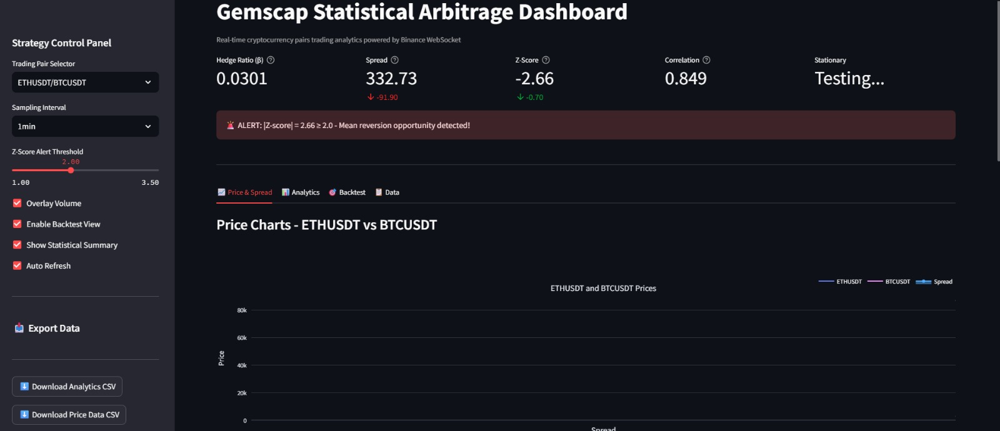
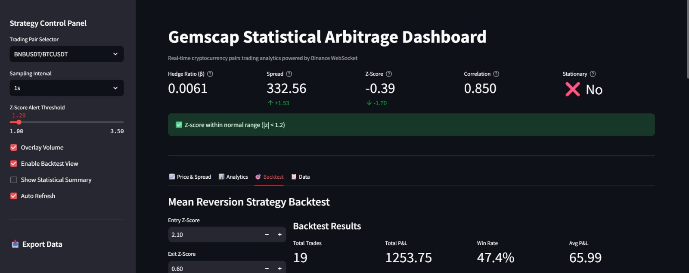

# 📈 Gemscap Statistical Arbitrage System

A **real-time cryptocurrency pairs trading analytics platform** built for quantitative traders, researchers, and developers. This system performs live statistical arbitrage analysis using Binance WebSocket data and presents actionable insights through an interactive dashboard and REST API.

---

## 🎯 Overview

The Gemscap Statistical Arbitrage System ingests live tick-level data from the Binance exchange, applies advanced statistical techniques such as hedge ratio estimation, spread modeling, z-score computation, and stationarity testing, and visualizes the results in real time.

It is designed as a **modular, extensible, and production-ready prototype** suitable for quantitative research, strategy validation, and interview/assessment demonstrations.

---

## ✨ Key Features

### 🔹 Core Analytics

* **Real-Time Data Ingestion** using Binance WebSocket API
* **Multi-Timeframe Processing** (1s, 1min, 5min)
* **Hedge Ratio Estimation** via OLS regression
* **Spread Construction** for mean reversion modeling
* **Rolling Z-Score Computation** for trade signals
* **ADF Stationarity Testing** for statistical validity
* **Rolling Correlation Tracking**
* **Volatility Estimation** (annualized)
* **Volume Pattern Analysis**

### 🔹 Advanced Capabilities

* **Mean Reversion Strategy Backtesting** with P&L tracking
* **Multi-Pair Comparison Dashboard**
* **Threshold-Based Alerts**
* **CSV / JSON Data Export**
* **RESTful API Access**
* **Interactive Charts** (zoom, pan, hover)

---

## 📸 Screenshots


Below are sample screenshots captured from the live system during execution.

### Dashboard Overview


### Alert Trigger


### Hedge Ratio Evolution


### Export Data


### Mean Reversion Strategy Backtest


### Raw Analytics Data


### Summary Statistics


### Volatility Analysis


---

## 🏗️ System Architecture

```
┌─────────────────┐
│  Binance API    │  Live tick data
└────────┬────────┘
         │
         ▼
┌─────────────────┐
│  ws_ingest.py   │  WebSocket → SQLite
└────────┬────────┘
         │
         ▼
┌─────────────────┐
│  market.db      │  Centralized storage
│  • ticks        │
│  • analytics    │
└────────┬────────┘
         │
         ▼
┌─────────────────┐
│  engine.py      │  Analytics processor
└────────┬────────┘
         │
         ▼
    ┌────┴────┐
    │         │
    ▼         ▼
┌────────┐ ┌────────┐
│  API   │ │ Dash   │  Visualization layers
└────────┘ └────────┘
```

---

## 📁 Project Structure

```
statistical-arbitrage-system/
├── config.yaml
├── requirements.txt
├── run_all.py
├── README.md
├── storage/
│   └── market.db
├── logs/
│   └── app.log
├── ingestion/
│   └── ws_ingest.py
├── analytics/
│   ├── computations.py
│   └── engine.py
├── api/
│   └── server.py
└── dashboard/
    └── app.py
```

---

## 🚀 Quick Start
1️⃣ Clone the Repository
git clone https://github.com/mayuriphad/Quant-Developer-Evaluation-Assignment.git
cd Quant-Developer-Evaluation-Assignment

2️⃣ Prerequisites

* Python **3.9+**
* pip
* Internet connection
* 2GB free disk space

3️⃣ Installation

```bash
python -m venv venv

# Windows
venv\Scripts\activate

# macOS / Linux
source venv/bin/activate

pip install -r requirements.txt
mkdir storage logs
```

---

## ▶️ Running the System

### ✅ One-Command Launch (Recommended)

```bash
python run_all.py
```

This launches:

* WebSocket ingestion
* Analytics engine
* REST API server
* Streamlit dashboard

Dashboard URL: **[http://localhost:8501](http://localhost:8501)**

---

### 🔧 Manual Launch (Advanced)

**Terminal 1 – Ingestion**

```bash
python -m ingestion.ws_ingest
```

**Terminal 2 – Analytics Engine**

```bash
python -m analytics.engine
```

**Terminal 3 – API Server (Optional)**

```bash
python -m api.server
```

**Terminal 4 – Dashboard**

```bash
streamlit run dashboard/app.py
```

---

## 📊 Dashboard Guide

### Main Metrics

* **Hedge Ratio (β)**
* **Spread Value**
* **Z-Score**
* **Correlation**
* **ADF Stationarity Result**

### Tabs

1. **Price & Spread**
2. **Analytics**
3. **Backtest**
4. **Raw Data & Export**

### Sidebar Controls

* Pair selection
* Timeframe selector
* Z-score alert threshold
* Auto-refresh toggle
* CSV export

---

## 🌐 REST API

Base URL: `http://localhost:8000`

| Endpoint             | Method | Description       |
| -------------------- | ------ | ----------------- |
| `/health`            | GET    | Health check      |
| `/pairs`             | GET    | Available pairs   |
| `/latest/{y}/{x}`    | GET    | Latest metrics    |
| `/analytics/{y}/{x}` | GET    | Full analytics    |
| `/spread/{y}/{x}`    | GET    | Spread series     |
| `/export/{y}/{x}`    | GET    | CSV / JSON export |
| `/stats/{y}/{x}`     | GET    | 24h summary       |

---

## ⚙️ Configuration (`config.yaml`)

```yaml
symbols:
  pairs:
    - [ETHUSDT, BTCUSDT]

analytics:
  timeframes: ["1s", "1min", "5min"]
  rolling_windows:
    zscore: 30
    correlation: 60
    volatility: 20

alerts:
  default_zscore_threshold: 2.0
```

---

## 📐 Analytics Methodology

### Hedge Ratio

```
Y = α + βX + ε
```

### Spread

```
Spread = Y − βX
```

### Z-Score

```
Z = (Spread − μ) / σ
```

### ADF Test

* p-value < 0.05 → Stationary ✓

### Mean Reversion Strategy

* **Entry:** |Z| > 2
* **Exit:** |Z| < 0.5

---

## 🛠️ Technology Stack

* **Python 3.9+**
* **SQLite / PostgreSQL-ready**
* **Pandas, NumPy**
* **Statsmodels, SciPy**
* **FastAPI, Uvicorn**
* **Streamlit, Plotly**
* **WebSockets, aiosqlite**

---

## 🎓 Use Cases

### Traders

* Identify mean reversion opportunities
* Monitor real-time z-scores

### Researchers

* Study cointegration in crypto markets
* Generate datasets for ML

### Developers

* Extend analytics
* Integrate via API

---

## 👩‍💻 Author

**Mayuri Phad**
📧 [mayuri.22320110@viit.ac.in](mailto:mayuri.22320110@viit.ac.in)
🔗 GitHub: [https://github.com/mayuriphad](https://github.com/mayuriphad)
🔗 LinkedIn: [https://www.linkedin.com/in/mayuriphad/](https://www.linkedin.com/in/mayuriphad/)

---
